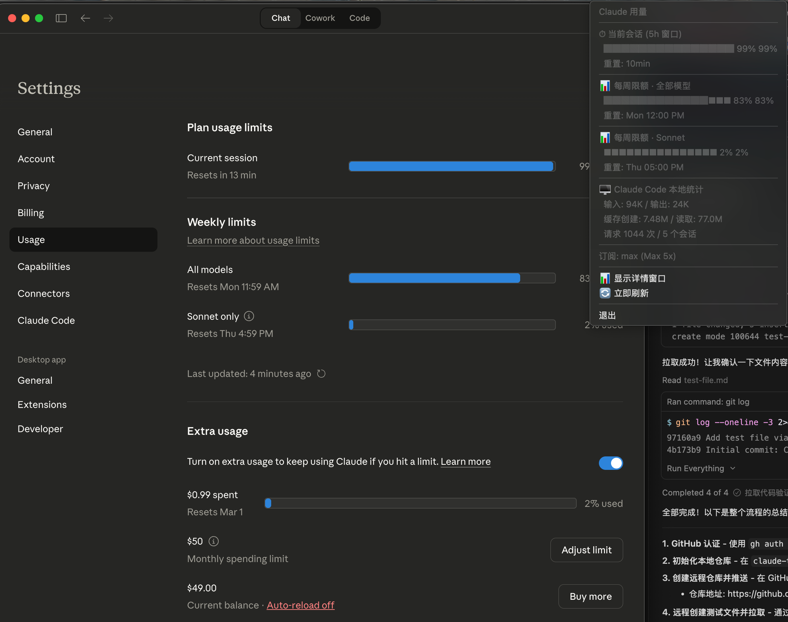

<div align="center">

# Claude Token Monitor

**macOS / Windows / Linux 跨平台系统托盘工具 —— 实时监控 Claude 订阅用量**

[](https://www.python.org/)
[](https://github.com/Die-Hu/claude-token-monitor)
[](https://github.com/Die-Hu/claude-token-monitor)
[](LICENSE)
[](https://github.com/Die-Hu/claude-token-monitor/releases)

[English](#english) | [中文](#中文说明)

</div>

---

## Why This Project Exists / 为什么做这个项目

> **Pain point / 痛点**: Claude Pro / Max / Team 订阅用户经常不清楚自己的 token 消耗进度，只能反复手动打开 [claude.ai Settings → Usage](https://claude.ai/settings/usage) 页面查看。尤其在高频使用 Claude Code CLI 时，很容易在不知不觉中触及速率限制（rate limit），被迫等待数小时。
>
> **Solution / 解决方案**: Claude Token Monitor 是一个轻量级的**系统托盘常驻工具**，自动读取 claude.ai 的实时用量数据，并结合本地 Claude Code 日志统计，让你**一眼就能看到**当前会话用量、每周限额进度和重置倒计时。
>
> 为避免之后的 AI 或程序员重复造轮子，并且满足个人日常使用方便，在此开源。

---

## Screenshots / 截图演示

<div align="center">



*左侧: Claude 官方 Usage 页面 | 右侧: Claude Token Monitor 系统托盘菜单*

</div>

**截图说明:**
- **系统托盘菜单** 直接在桌面角落显示所有关键用量指标
- **当前会话 (5h 窗口)** — 99% 已用，10 分钟后重置
- **每周限额 · 全部模型** — 83%，周一重置
- **每周限额 · Sonnet** — 2%，周四重置
- **Claude Code 本地统计** — 输入/输出 token、缓存读写、请求次数
- **订阅信息** — 订阅等级与速率倍率

---

## Features / 核心功能

### Real-time Usage Monitoring / 实时用量监控
- **5 小时会话窗口 (Current Session)** — 当前滚动窗口内的 token 消耗百分比
- **每周全模型限额 (Weekly All Models)** — 7 天周期内所有模型的累计用量
- **每周 Sonnet 限额 (Weekly Sonnet)** — 7 天周期内 Sonnet 模型单独用量
- **Extra Usage 额外用量** — 超出限额后的付费用量追踪
- **自动刷新** — 每 60 秒自动更新数据

### Visual Indicators / 可视化指示
- **彩色进度条** — 绿色 (< 40%) → 黄色 (< 70%) → 红色 (>= 70%)
- **系统托盘图标动态变色** — 蓝色(正常) / 黄色(警告) / 红色(接近上限)
- **实时倒计时** — 显示会话重置剩余时间，精确到秒

### Local Claude Code Statistics / 本地 Claude Code 统计
- **Input / Output Tokens** — 输入和输出 token 计数
- **Cache Creation / Read** — 缓存创建和读取量
- **Session & Request Count** — 会话数和请求次数统计
- **Billable Token Calculation** — 可计费 token 计算

### Subscription & Tier Info / 订阅与速率信息
- 自动读取 Claude Code OAuth 凭证
- 显示订阅类型 (Pro / Max / Team)
- 显示速率等级 (Max 5x 等)

### Internationalization / 国际化
- **双语支持** — 中文 / English
- **自动检测** — 根据系统语言自动切换
- **手动切换** — 通过 `CTM_LANG` 环境变量覆盖

---

## Architecture / 技术架构

```
claude-token-monitor/
├── src/claude_token_monitor/     # 主程序包（跨平台）
│   ├── main.py                   # 应用入口 (tkinter + pystray)
│   ├── monitor/
│   │   ├── combined.py           # 组合监控器：聚合多数据源
│   │   ├── web_monitor.py        # Web 监控：调用 claude.ai API
│   │   ├── log_monitor.py        # 日志监控：解析本地 JSONL 日志
│   │   └── auth.py               # OAuth 凭证管理
│   ├── platform/
│   │   ├── paths.py              # 跨平台路径检测
│   │   └── auth.py               # 平台凭证读取 (Keychain/WinCred)
│   ├── ui/
│   │   ├── tray.py               # 系统托盘图标
│   │   ├── detail_window.py      # 详情浮窗 (tkinter)
│   │   └── theme.py              # 暗色主题常量
│   └── i18n/                     # 国际化
│       ├── en.py                 # English
│       └── zh.py                 # 中文
├── monitor/                       # macOS 原生版模块
├── ui/                            # macOS 原生版 UI (PyObjC/rumps)
├── main.py                        # macOS 原生版入口
├── .github/workflows/release.yml  # CI/CD 自动构建
├── pyproject.toml                 # 包配置与依赖
└── requirements.txt               # Python 依赖
```

### How It Works / 工作原理

```
┌─────────────────────────────────────────────────────────────┐
│                     Claude Token Monitor                     │
├──────────────┬──────────────────┬───────────────────────────┤
│  Web Monitor │   Log Monitor    │      Auth Manager         │
│              │                  │                           │
│ Chrome Cookie│ ~/.claude/       │ macOS Keychain /          │
│ → claude.ai  │ projects/*/*.jsonl│ Windows Credential Store  │
│ → /api/usage │ → token 统计     │ → 订阅信息                │
├──────────────┴──────────────────┴───────────────────────────┤
│                    Combined Monitor                          │
│          (每 60 秒聚合所有数据源)                              │
├─────────────────────────────────────────────────────────────┤
│                        UI Layer                              │
│    System Tray Icon  +  Detail Window  +  Countdown Timer   │
└─────────────────────────────────────────────────────────────┘
```

1. **读取 Chrome Cookie** — 从 Chrome 浏览器自动提取 `sessionKey` cookie
2. **调用 claude.ai API** — 访问 `/api/organizations/{uuid}/usage` 获取实时用量
3. **解析本地日志** — 扫描 `~/.claude/projects/**/*.jsonl` 统计 token 用量
4. **读取 OAuth 凭证** — 从系统凭证存储获取订阅信息
5. **聚合展示** — 系统托盘图标 + 悬浮详情窗口实时展示所有数据

---

## Requirements / 环境要求

| 项目 | 要求 |
|------|------|
| **Python** | 3.10 或更高版本 |
| **操作系统** | macOS / Windows / Linux |
| **浏览器** | Google Chrome（需已登录 [claude.ai](https://claude.ai)） |
| **Claude Code** | 已安装 Claude Code CLI（可选，用于本地统计和订阅信息） |

---

## Quick Start / 快速开始

### 方式一：脚本启动（推荐）

**macOS / Linux:**

```bash
git clone https://github.com/Die-Hu/claude-token-monitor.git
cd claude-token-monitor
chmod +x scripts/start.sh
./scripts/start.sh
```

**Windows:**

```cmd
git clone https://github.com/Die-Hu/claude-token-monitor.git
cd claude-token-monitor
scripts\start.bat
```

### 方式二：手动安装

```bash
git clone https://github.com/Die-Hu/claude-token-monitor.git
cd claude-token-monitor
pip install -r requirements.txt
cd src
python -m claude_token_monitor
```

### 方式三：pip 安装

```bash
pip install -e .
claude-token-monitor
```

### 方式四：macOS 原生版

```bash
# 需额外安装 rumps 和 PyObjC
pip install rumps pyobjc
python main.py
```

---

## Configuration / 配置

| 环境变量 | 说明 | 默认值 | 示例 |
|----------|------|--------|------|
| `CTM_LANG` | 界面语言 | 自动检测系统语言 | `en` 或 `zh` |

```bash
# 强制使用英文界面
CTM_LANG=en python -m claude_token_monitor

# 强制使用中文界面
CTM_LANG=zh python -m claude_token_monitor
```

---

## Building Standalone App / 打包独立应用

### macOS (.app)

```bash
pip install pyinstaller
pyinstaller build/build_macos.spec
# 输出: dist/Claude Token Monitor.app
```

### Windows (.exe)

```cmd
pip install pyinstaller
pyinstaller build/build_windows.spec
# 输出: dist/Claude Token Monitor.exe
```

### GitHub Actions 自动构建

项目已配置 GitHub Actions CI/CD，推送版本标签 (`v*`) 时自动构建 macOS 和 Windows 安装包并发布 Release。

---

## Dependencies / 依赖

| 包名 | 版本 | 用途 |
|------|------|------|
| [pystray](https://github.com/moses-palmer/pystray) | >= 0.19 | 系统托盘图标 |
| [Pillow](https://pillow.readthedocs.io/) | >= 9.0 | 图像处理（托盘图标渲染） |
| [browser-cookie3](https://github.com/borisbabic/browser_cookie3) | >= 0.20 | Chrome Cookie 提取 |
| [keyring](https://github.com/jaraco/keyring) | >= 24.0 | 系统凭证存储访问 |
| [cryptography](https://cryptography.io/) | latest | 安全相关工具 |

**可选依赖（macOS 原生版）:**
- [rumps](https://github.com/jaredks/rumps) — macOS 原生菜单栏应用
- [PyObjC](https://pyobjc.readthedocs.io/) — macOS 原生浮窗面板

---

## Troubleshooting / 常见问题

<details>
<summary><b>Q: 提示找不到 Chrome Cookie / Cookie 读取失败</b></summary>

确保 Google Chrome 已安装并且已登录 [claude.ai](https://claude.ai)。程序会自动扫描 Chrome 的所有 Profile，查找包含 `sessionKey` 的 cookie。

- macOS: `~/Library/Application Support/Google/Chrome/`
- Windows: `%LOCALAPPDATA%\Google\Chrome\User Data\`
- Linux: `~/.config/google-chrome/`

</details>

<details>
<summary><b>Q: API 返回 401/403 错误</b></summary>

说明 Chrome 中的 claude.ai 登录已过期。请在 Chrome 中重新登录 [claude.ai](https://claude.ai)，然后点击托盘菜单中的「立即刷新」。

</details>

<details>
<summary><b>Q: 本地统计数据为空</b></summary>

本地统计依赖 Claude Code CLI 产生的 JSONL 日志文件（位于 `~/.claude/projects/`）。如果你没有使用过 Claude Code CLI，这部分数据将为空，不影响其他功能。

</details>

<details>
<summary><b>Q: macOS 下 tkinter 报错</b></summary>

macOS 自带的 Python 可能缺少 tkinter。建议使用 Homebrew 安装 Python:

```bash
brew install python-tk@3.12
```

</details>

---

## Roadmap / 路线图

- [ ] 支持更多浏览器（Firefox、Edge、Safari）
- [ ] 用量达到阈值时推送系统通知
- [ ] 历史用量趋势图表
- [ ] 多账号切换支持
- [ ] 自定义刷新间隔
- [ ] Docker 部署方案

---

## Contributing / 贡献

欢迎提交 Issue 和 Pull Request！

1. Fork 本仓库
2. 创建特性分支 (`git checkout -b feature/amazing-feature`)
3. 提交修改 (`git commit -m 'Add amazing feature'`)
4. 推送到分支 (`git push origin feature/amazing-feature`)
5. 开启 Pull Request

---

## License / 开源协议

本项目基于 [MIT License](LICENSE) 开源。

Copyright (c) 2025-2026 Claude Token Monitor Contributors

---

<div align="center">

**Keywords / 关键词:**

`claude` `token` `monitor` `usage` `tracker` `rate-limit` `claude-pro` `claude-max` `claude-team` `subscription` `anthropic` `api-usage` `system-tray` `menubar` `macos` `windows` `cross-platform` `python` `claude-code` `token-counter` `usage-monitor` `claude-ai` `quota` `speed-limit` `订阅用量` `速率限制` `用量监控` `token计数`

---

*如果这个工具对你有帮助，请给个 Star 支持一下！*

</div>

---

<a id="english"></a>

## English

### Overview

**Claude Token Monitor** is a lightweight, cross-platform system tray application that monitors your Claude subscription usage in real time. It automatically fetches live usage data from claude.ai and combines it with local Claude Code log statistics, so you can see your current session usage, weekly quota progress, and reset countdowns at a glance.

### Key Features

- **Real-time monitoring** of Claude Pro/Max/Team subscription usage
- **5-hour session window** tracking with live countdown timer
- **Weekly quota** tracking for all models and Sonnet separately
- **Color-coded progress bars** (green → yellow → red)
- **Dynamic tray icon** color changes based on usage level
- **Local Claude Code statistics** (tokens, cache, sessions)
- **Subscription tier display** (Pro, Max 5x, etc.)
- **Bilingual UI** (English / Chinese) with auto-detection
- **Cross-platform** support: macOS, Windows, Linux

### How It Works

1. Reads `sessionKey` cookie from Chrome to authenticate with claude.ai
2. Fetches real usage percentages from `/api/organizations/{uuid}/usage`
3. Parses local Claude Code JSONL logs for token statistics
4. Reads Claude Code OAuth credentials for subscription info
5. Displays everything in a system tray icon + detail window
6. Auto-refreshes every 60 seconds

### Installation

```bash
git clone https://github.com/Die-Hu/claude-token-monitor.git
cd claude-token-monitor
pip install -r requirements.txt
cd src && python -m claude_token_monitor
```

### Requirements

- Python 3.10+
- Google Chrome with an active [claude.ai](https://claude.ai) login session
- Claude Code CLI (optional, for local stats and subscription info)

---

<div align="center">

Made with care for the Claude community.

</div>
